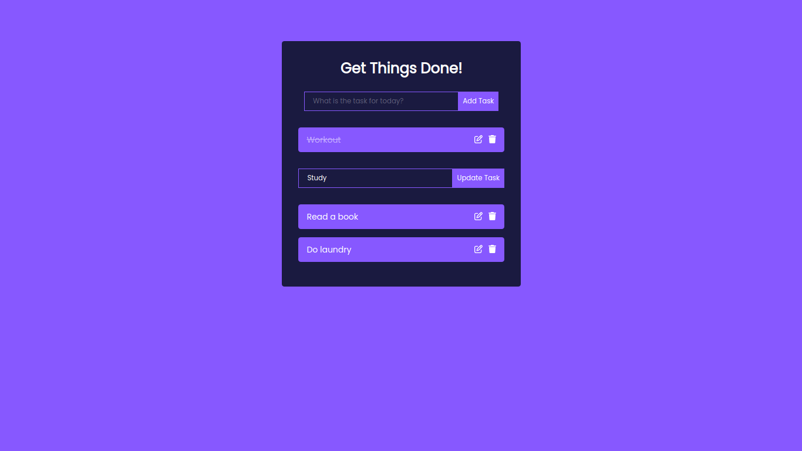

# ReactJS Todo App

This is a basic Todo App built using ReactJS. It allows you to add, mark as complete,  remove tasks, and even update the pre-existing task of your todo list.



## Table of Contents

- [Features](#features)
- [Demo](#demo)
- [Installation](#installation)
- [Usage](#usage)
- [License](#license)

## Features

- Add tasks to your todo list.
- Mark tasks as complete.
- Remove tasks from the list.
- Update pre-exisitng tasks from the list.

## Demo

You can see the live demo of the app [here](https://bentekku.github.io/to-do-reactjs/).

## Installation

1. Clone the repository:

   ```bash
   git clone https://github.com/bentekku/to-do-reactjs.git
   ```

2. Navigate to the project directory:

   ```bash
   cd to-do-reactjs
   ```

3. Install the dependencies:

   ```bash
   npm install
   ```

## Usage

1. Start the development server:

   ```bash
   npm start
   ```

2. The above npm command should automatically open your default browser and will be navigated to `http://localhost:3000`. Incase, if the browser does not open and navigate to localhost automatically, do so manually by opneing your browser and navigate to `http://localhost:3000` to see the app in action.

3. Add tasks by typing in the input field and hitting the "Add" button.

4. Mark tasks as complete by clicking the checkbox next to the task.

5. Remove tasks by clicking the "Delete" button next to the task.

6. To update a task simply click on the "Edit" button next the task.

## License

This project is licensed under the [MIT License](LICENSE).
